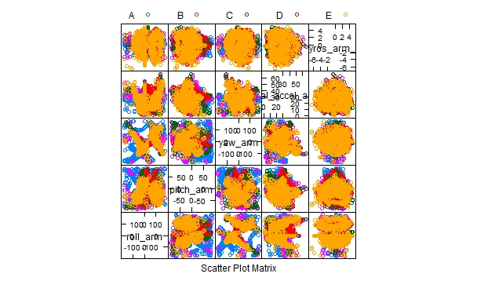
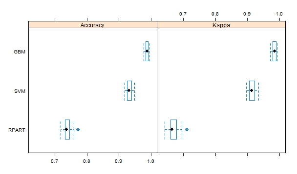
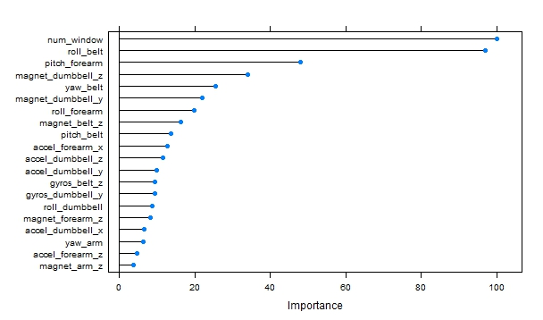

## Introduction

This assignment asked the students to use the dataset provided by the site http://groupware.les.inf.puc-rio.br/har to construct a supervised prediction model that can accurately predict the outcomes for the 20 different test cases in the provided testing dataset. The outcomes are categorical factors that indicate whether a barbell lifting exercise was done correctly by the participants. If the outcome is "A", the exercise was done correctly.  Otherwise, if the outcome is among "B" to "E", it's done incorrectly to various degrees. For this assignment, we only predict to which category each test case belongs.

## Data preparation

The training dataset and the test cases were imported into dataframe objects as **traindata** and **testdata** accordingly.  There are 19622 observations with 160 variables.  Not all the variables were used as predictors as described in the following.

I first used the function **nearZeroVar** to identify near zero-variance predictors in the **traindata** and removed them as the predictors:

```{r, eval=FALSE}
nzvci <- nearZeroVar(traindata,saveMetrics=TRUE)
nzvci <- subset(nzvci,nzvci$nzv==TRUE)
tmp <- traindata[,!(colnames(traindata)%in%rownames(nzvci))]
```

Next, there are many variables having many **NA** values. I do not use them as predictors:

```{r, eval=FALSE}
tmp <- tmp[,colSums(is.na(tmp))==0]
```

The first five variables corresponds to names, dates, and timestamps, which are not very useful for constructing a general model to predict whether an anonomous exerciser is doing an exercise correctly.  Those variables were not used as predictors:

```{r, eval=FALSE}
tmp <- tmp[,-c(1:5)]
```

There were 54 variables left afterward. Because using **featurePlot** couldn't give a clearer indication of the data features, I used 53 of them as the predictors, although an earlier PCA analysis indicated that maybe 26 predictors should be enough to capture 95% of the variation in the data. A sample **featurePlot** output, for the variables on columns 15 to 19, was shown below after the code section.  I then constructed the **training** and **testing** dataset as the following:

```{r, eval=FALSE}
inTrain <- createDataPartition(y=tmp$classe,p=0.75,list=F)
training <- tmp[inTrain,]
testing <- tmp[-inTrain,]
```




## Building and tuning models

I used the following machine learning models and compared the accuracy between them: **rpart**, **gbm**, **svmRadial**. Accuracy was used to select the final optimal model. For cross-validation, each model is automatically tuned and evaluated using 3 repeats of 10-fold **repeatedcv** method.  In order to make meaningful comparisons and to ensure that each model uses the same data partitions and repeats, the random number seed was set to the same value before each model training.

```{r, eval=FALSE}
control <- trainControl(method="repeatedcv",number=10,repeats=3)

set.seed(7)
modelRpart <- train(classe ~ ., data=training, method="rpart", tuneLength=15, trControl=control,preProc=c("center","scale"))

set.seed(7)
modelGbm <- train(classe ~ ., data=training, method="gbm", trControl=control,verbose=FALSE)

set.seed(7)
modelSvm <- train(classe ~ ., data=training, method="svmRadial", trControl=control)
```

To compare the accuracy distribution between the models, the **resamples** function was used to collect, summarize and contrast the results.  In addition to the summary table, I also plot the results as a boxplot:

```{r, eval=FALSE}
results2 <- resamples(list(RPART=modelRpart, GBM=modelGbm, SVM=modelSvm))
summary(results2)
bwplot(results2)
```

***
```{r, eval=FALSE}
Call:
summary.resamples(object = results2)

Models: RPART, GBM, SVM 
Number of resamples: 30 

Accuracy 
        Min. 1st Qu. Median   Mean 3rd Qu.   Max. NA's
RPART 0.7179  0.7318 0.7367 0.7393  0.7456 0.7738    0
GBM   0.9776  0.9837 0.9885 0.9874  0.9910 0.9939    0
SVM   0.9179  0.9259 0.9317 0.9319  0.9378 0.9483    0

Kappa 
        Min. 1st Qu. Median   Mean 3rd Qu.   Max. NA's
RPART 0.6420  0.6595 0.6651 0.6689  0.6771 0.7122    0
GBM   0.9716  0.9794 0.9854 0.9841  0.9886 0.9923    0
SVM   0.8958  0.9062 0.9135 0.9138  0.9212 0.9346    0
```
***



***

From the summary and the boxplot, one can see that the **gbm** model has much higher accuracy than the other models.  It has the median accuracy of 0.9885.  I'll use the **gbm** model to predict the 20 test cases.


## Testing and the expected out-of-sample error

The optimal **gbm** model was used to test the reserved **testing** data partition and the **confusionMatrix** function was used to estimate out-of-sample error rate. The expected out-of-sample error is about **1%**.

```{r, eval=FALSE}
mtxGbm <- confusionMatrix(testing$classe, predict(modelGbm,newdata=testing))
mtxGbm
```

***
```{r, eval=FALSE}
Confusion Matrix and Statistics

          Reference
Prediction    A    B    C    D    E
         A 1393    1    0    1    0
         B    6  933    8    2    0
         C    0    4  850    1    0
         D    0    2   11  791    0
         E    0    4    0    6  891

Overall Statistics
                                          
               Accuracy : 0.9906          
                 95% CI : (0.9875, 0.9931)
    No Information Rate : 0.2853          
    P-Value [Acc > NIR] : < 2.2e-16       
                                          
                  Kappa : 0.9881          
 Mcnemar's Test P-Value : NA              

Statistics by Class:

                     Class: A Class: B Class: C Class: D Class: E
Sensitivity            0.9957   0.9883   0.9781   0.9875   1.0000
Specificity            0.9994   0.9960   0.9988   0.9968   0.9975
Pos Pred Value         0.9986   0.9831   0.9942   0.9838   0.9889
Neg Pred Value         0.9983   0.9972   0.9953   0.9976   1.0000
Prevalence             0.2853   0.1925   0.1772   0.1633   0.1817
Detection Rate         0.2841   0.1903   0.1733   0.1613   0.1817
Detection Prevalence   0.2845   0.1935   0.1743   0.1639   0.1837
Balanced Accuracy      0.9976   0.9922   0.9884   0.9922   0.9988
```
***

## Summary

Using a combination of **nearZeroVar** and **NA** removal, we used 53 out of the 160 variables in the raw dataset as the predictors. The raw dataset was partitioned into **training** and **testing** datasets.  Three sophisticated machine learning models were used and trained to get an optimal model. To conserve the computation time, each model was automatically tuned and evaluated using **repeatedcv** method with 3 repeats and 10-fold cross validation setting. The random number seed was set to the same value.  The **resamples** function was used to collect and summarize the resampling results for comparison and a boxplot of the results was provided to show the contrast of the accuracy.  Accuracy was used to select the final model.  The **gbm** model was selected and will be used to predict the outcomes of the 20 test cases.  To estimate the out-of-sample error, the **confusionMatrix** was constructed using the **gbm** model on the **testing** dataset.  It's estimated to be about **1%**.

To get the predicted outcomes of the 20 test cases in the assignment, one needs to use the following command:

```{r, eval=FALSE}
predTest <- predict(modelGbm,testdata)
```

Finally, to get a sense about relative importance of the predictors used, one can use **varImp** to check:

```{r, eval=FALSE}
plot(varImp(modelGbm),top=20)
```




***

#### References
* Course notes
* "Building Predictive Models in R Using the caret Package", Max Kuhn, Journal of Statistical Software, Vol. 28, Issue 5, 2008.
* "Compare Models And Select The Best Using The Caret R Package", Jason Brownlee, Sep. 24, 2014. http://machinelearningmastery.com/compare-models-and-select-the-best-using-the-caret-r-package/
* "Model Training and Tuning", Dec. 31, 2014. https://topepo.github.io/caret/training.html, 


